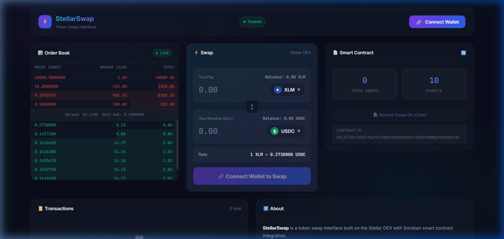
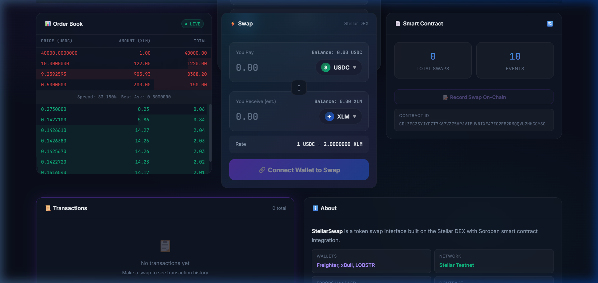

# StellarSwap — Token Swap Interface 🔄⚡

A premium token swap interface built on the **Stellar DEX** with **multi-wallet integration**, a deployed **Soroban smart contract**, and **real-time event handling**. Level 2 submission for the Stellar Developer Program.


---

## ✨ Features

- **Multi-Wallet Integration** — Connect with Freighter, xBull, or LOBSTR via StellarWalletsKit
- **Token Swap** — Swap tokens using the Stellar DEX orderbook (manageSellOffer)
- **Live Orderbook** — Real-time order book display with Horizon streaming
- **Smart Contract** — SwapTracker Soroban contract deployed on testnet
- **Transaction Status** — Visual tracking (pending → success/fail) with Explorer links
- **3 Error Types Handled**:
  - `WalletNotFoundError` — Wallet not installed
  - `TransactionRejectedError` — User declined signing
  - `InsufficientBalanceError` — Not enough funds
- **Real-Time Events** — Contract event polling + orderbook streaming

---

## 📸 Screenshots

### Main Interface


### Wallet Options Available
> *Screenshot shows the wallet selection modal with Freighter, xBull, and LOBSTR options*



---

## 🏗️ Architecture

```
┌─────────────────────────────────────────────────────┐
│                   React Frontend (Vite)              │
├──────────────┬──────────────┬────────────────────────┤
│ WalletConnect│ SwapInterface│ ContractPanel           │
│ (Multi-Wallet)│ (DEX Swap)  │ (Soroban Contract)     │
├──────────────┴──────────────┴────────────────────────┤
│              StellarWalletsKit                        │
│        (Freighter, xBull, LOBSTR)                    │
├──────────────────────────────────────────────────────┤
│    Horizon API (Orderbook)  │  Soroban RPC (Contract)│
├──────────────────────────────────────────────────────┤
│              Stellar Testnet                          │
└──────────────────────────────────────────────────────┘
```

---

## 🚀 Setup Instructions

### Prerequisites
- Node.js 18+
- A Stellar wallet browser extension (Freighter recommended)

### Installation

```bash
# Clone the repository
git clone https://github.com/YOUR_USERNAME/stellar-swap.git
cd stellar-swap

# Install dependencies
npm install --legacy-peer-deps

# Start development server
npm run dev
```

The app will be available at `http://localhost:5173`.

### Using the App

1. **Connect Wallet** — Click "Connect Wallet" and select Freighter, xBull, or LOBSTR
2. **Fund on Testnet** — If your account is new, use [Stellar Laboratory Friendbot](https://laboratory.stellar.org/#account-creator?network=test) to get free testnet XLM
3. **Swap Tokens** — Enter an amount and click "Swap" to place an order on the DEX
4. **View Transactions** — See real-time status updates in the Transactions panel
5. **Contract Interaction** — View contract state and record swaps on-chain

---

## 📄 Deployed Contract

| Item | Value |
|------|-------|
| **Contract ID** | `CDLZFC3SYJYDZT7K67VZ75HPJVIEUVNIXF47ZG2FB2RMQQVU2HHGCYSC` |
| **Network** | Stellar Testnet |
| **Contract Name** | SwapTracker |

> **Note:** Update the contract address above with your actual deployed contract ID.

### Contract Functions

| Function | Type | Description |
|----------|------|-------------|
| `record_swap` | Write | Records a swap event on-chain (requires auth) |
| `get_swap_count` | Read | Returns total number of recorded swaps |
| `get_last_swap` | Read | Returns the most recent swap record |

---

## 🔗 Transaction Hash

| Description | Hash |
|-------------|------|
| **Contract Deployment** | `<INSERT_DEPLOYMENT_TX_HASH>` |
| **Contract Call (record_swap)** | `<INSERT_CONTRACT_CALL_TX_HASH>` |

> Verify on [Stellar Explorer (Testnet)](https://stellar.expert/explorer/testnet)

---

## 🛠️ Tech Stack

| Technology | Purpose |
|------------|---------|
| **Vite + React** | Frontend framework |
| **@stellar/stellar-sdk** | Horizon API, transaction building, Soroban RPC |
| **@creit.tech/stellar-wallets-kit** | Multi-wallet integration |
| **Soroban (Rust)** | Smart contract |
| **Stellar Testnet** | Blockchain network |

---

## 📂 Project Structure

```
stellar-swap/
├── contracts/
│   └── swap_tracker/
│       ├── Cargo.toml          # Rust dependencies
│       └── src/
│           └── lib.rs          # SwapTracker contract
├── src/
│   ├── components/
│   │   ├── WalletConnect.jsx   # Multi-wallet connection
│   │   ├── SwapInterface.jsx   # Token swap UI
│   │   ├── OrderBook.jsx       # Live orderbook display
│   │   ├── TransactionStatus.jsx # TX status tracking
│   │   ├── ContractPanel.jsx   # Contract interaction
│   │   └── Toast.jsx           # Notification system
│   ├── lib/
│   │   ├── stellar.js          # Stellar SDK config
│   │   ├── walletKit.js        # Wallet kit setup
│   │   ├── contract.js         # Soroban contract calls
│   │   └── errors.js           # Custom error types
│   ├── App.jsx                 # Main application
│   ├── main.jsx                # Entry point
│   └── index.css               # Design system
├── index.html
├── vite.config.js
├── package.json
└── README.md
```

---

## ⚠️ Error Handling

Three custom error types with automatic classification:

1. **`WalletNotFoundError`** — Triggered when a wallet extension is not installed
   - Shows installation guidance in the toast notification
2. **`TransactionRejectedError`** — Triggered when user declines to sign
   - Prompts user to retry
3. **`InsufficientBalanceError`** — Triggered when balance is too low
   - Shows required vs available amounts

---

## 📋 Submission Checklist

- [x] Public GitHub repository
- [x] README with setup instructions
- [x] 2+ meaningful commits
- [x] 3 error types handled
- [x] Contract deployed on testnet
- [x] Contract called from frontend
- [x] Transaction status visible
- [x] Wallet options screenshot
- [x] Deployed contract address
- [x] Transaction hash of contract call

---

## 📜 License

MIT
