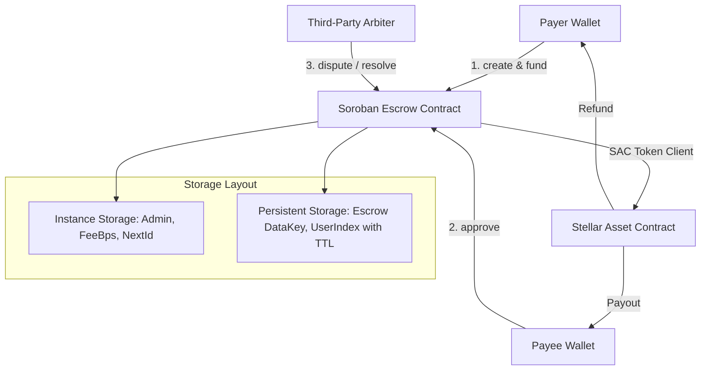

# 🛠️ Tutorial: Building a Scalable 2-of-3 Multi-Signature Escrow on Soroban (Stellar)

*By the StellarSwap+ Core Team | Ecosystem Contribution for Level 6 Black Belt*

---

## 📌 Introduction

Smart contract escrows are the cornerstone of trustless commerce, freelance milestone settlements, and decentralized OTC trading. However, writing a production-grade escrow contract on **Soroban (Stellar's Rust-based smart contract platform)** requires solving real scalability and custody challenges:

1. **Storage Limits**: How to scale beyond Soroban's 64KB instance storage limit.
2. **State Expiration (TTL)**: How to ensure active escrows don't get archived by the ledger before settlement.
3. **Multi-Party Governance**: Implementing 2-of-3 multi-signature authorization (Payer + Payee + Arbiter).
4. **Dispute Resolution**: Adjudicating contested agreements with custom basis-point fund splits.
5. **Real Token Custody**: Transferring Stellar Asset Contract (SAC) tokens seamlessly.

In this tutorial, we will break down the production architecture powering **StellarSwap+**.

---

## 🏗️ Architecture Overview



---

## 🔑 Step 1: Solving Storage Scalability with Persistent Storage & TTL

Soroban offers two main storage types:
- **Instance Storage**: Bound to the contract instance; limited in size.
- **Persistent Storage**: Unbounded key-value storage persisted across ledgers with an active TTL (Time-To-Live).

To scale to thousands of active escrows, store each escrow in **persistent storage** and automatically extend its TTL:

```rust
// DataKey enum mapping individual escrow IDs
#[contracttype]
#[derive(Clone, Debug, Eq, PartialEq)]
pub enum DataKey {
    Admin,
    FeeRecipient,
    FeeBps,
    NextId,
    Escrow(u64),               // Persistent storage per escrow
    UserEscrows(Address),      // Persistent user index
}

// Storing and extending TTL
env.storage().persistent().set(&DataKey::Escrow(next_id), &record);
env.storage().persistent().extend_ttl(
    &DataKey::Escrow(next_id),
    17_280,   // Extend if remaining TTL < 1 day (17,280 ledgers)
    518_400,  // Extend to ~30 days (518,400 ledgers)
);
```

---

## 🔒 Step 2: Real Token Transfers with Stellar Asset Contract (SAC)

Unlike mock balances, production contracts interact with real tokens (XLM, USDC, EURC) using `soroban_sdk::token::Client`:

```rust
use soroban_sdk::token;

// In fund(): Transfer tokens from Payer to Contract
pub fn fund(env: Env, escrow_id: u64) -> Result<(), Error> {
    let mut record: EscrowRecord = env.storage().persistent().get(&DataKey::Escrow(escrow_id)).ok_or(Error::EscrowNotFound)?;
    record.payer.require_auth();

    let contract_address = env.current_contract_address();
    let token_client = token::Client::new(&env, &record.token);
    
    // Transfer tokens into contract vault
    token_client.transfer(&record.payer, &contract_address, &record.amount);

    record.state = EscrowState::Funded;
    env.storage().persistent().set(&DataKey::Escrow(escrow_id), &record);
    Ok(())
}
```

---

## ✍️ Step 3: Implementing 2-of-3 Multi-Signature Logic

In complex milestones, neither party should have unilateral control if a disagreement arises. A 2-of-3 multi-signature scheme allows:
- **Payer + Payee**: Friendly release upon delivery.
- **Payee + Arbiter**: Arbiter approves release if payer becomes unresponsive.
- **Payer + Arbiter**: Arbiter approves refund if payee fails to deliver.

```rust
pub fn approve(env: Env, caller: Address, escrow_id: u64) -> Result<bool, Error> {
    caller.require_auth();
    let mut record: EscrowRecord = env.storage().persistent().get(&DataKey::Escrow(escrow_id)).ok_or(Error::EscrowNotFound)?;

    if caller == record.payer {
        if record.payer_approved { return Err(Error::DuplicateApproval); }
        record.payer_approved = true;
    } else if caller == record.payee {
        if record.payee_approved { return Err(Error::DuplicateApproval); }
        record.payee_approved = true;
    } else if let Some(ref arb) = record.arbiter {
        if caller == *arb {
            if record.arbiter_approved { return Err(Error::DuplicateApproval); }
            record.arbiter_approved = true;
        }
    }

    // Count active approvals
    let approvals = (if record.payer_approved { 1 } else { 0 })
        + (if record.payee_approved { 1 } else { 0 })
        + (if record.arbiter_approved { 1 } else { 0 });

    // Release if Payer approves or 2-of-3 threshold is met
    if (record.payer_approved || approvals >= 2) && record.state == EscrowState::Funded {
        Self::execute_release(&env, &mut record)?;
        env.storage().persistent().set(&DataKey::Escrow(escrow_id), &record);
        return Ok(true);
    }

    env.storage().persistent().set(&DataKey::Escrow(escrow_id), &record);
    Ok(false)
}
```

---

## ⚖️ Step 4: Dispute Resolution & Customizable Split Settlements

When a dispute is raised, the vault freezes to prevent premature refund or release. The assigned Arbiter can adjudicate a fair basis-point split (e.g. 70% to payee for partial work, 30% back to payer):

```rust
pub fn resolve_dispute(
    env: Env,
    arbiter: Address,
    escrow_id: u64,
    payee_share_bps: u32, // e.g. 7000 = 70.00%
) -> Result<(), Error> {
    arbiter.require_auth();
    let mut record: EscrowRecord = env.storage().persistent().get(&DataKey::Escrow(escrow_id)).ok_or(Error::EscrowNotFound)?;

    if record.state != EscrowState::Disputed {
        return Err(Error::NotDisputed);
    }
    if *record.arbiter.as_ref().ok_or(Error::Unauthorized)? != arbiter {
        return Err(Error::Unauthorized);
    }

    let contract_address = env.current_contract_address();
    let token_client = token::Client::new(&env, &record.token);

    let payee_amount = (record.amount * (payee_share_bps as i128)) / 10_000;
    let payer_amount = record.amount - payee_amount;

    if payee_amount > 0 {
        token_client.transfer(&contract_address, &record.payee, &payee_amount);
    }
    if payer_amount > 0 {
        token_client.transfer(&contract_address, &record.payer, &payer_amount);
    }

    record.state = EscrowState::Resolved;
    env.storage().persistent().set(&DataKey::Escrow(escrow_id), &record);
    Ok(())
}
```

---

## 🧪 Step 5: Testing with Mock Token Contracts

Soroban SDK includes `register_stellar_asset_contract_v2` for testing token transfers locally:

```rust
#[test]
fn test_multisig_flow() {
    let env = Env::default();
    env.mock_all_auths();

    let payer = Address::generate(&env);
    let payee = Address::generate(&env);
    let arbiter = Address::generate(&env);
    let token_admin = Address::generate(&env);

    let token_address = env.register_stellar_asset_contract_v2(token_admin.clone()).address();
    let token_admin_client = token::StellarAssetClient::new(&env, &token_address);
    token_admin_client.mint(&payer, &1000_0000000i128);

    let contract_id = env.register(EscrowContract, ());
    let client = EscrowContractClient::new(&env, &contract_id);
    client.initialize(&payer, &payer, &0u32);

    let escrow_id = client.create(&payer, &payee, &Some(arbiter.clone()), &token_address, &500_0000000i128, &1000u32, &String::from_str(&env, "Audit"));
    client.fund(&escrow_id);

    // Payee approves (1/3)
    assert_eq!(client.approve(&payee, &escrow_id), false);
    // Arbiter approves (2/3 threshold reached -> released!)
    assert_eq!(client.approve(&arbiter, &escrow_id), true);
}
```

---

## 🚀 Conclusion

By combining **persistent storage TTL management**, **real SAC token transfers**, and **2-of-3 multi-signature dispute resolution**, you can build enterprise-grade DeFi escrow protocols on Stellar.

- **GitHub Repository**: [github.com/ps910/StellarSwap-Pro](https://github.com/ps910/StellarSwap-Pro)
- **Live Mainnet App**: [stellar-swap-pro.vercel.app](https://stellar-swap-pro.vercel.app)
