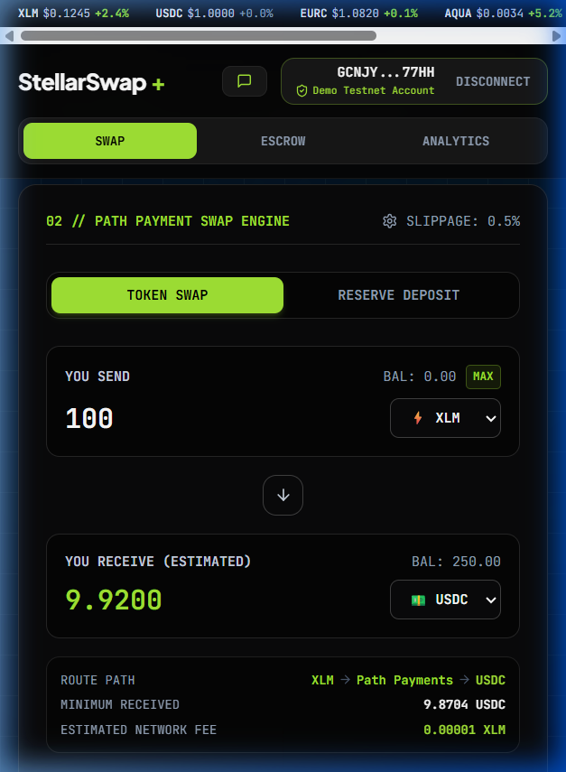
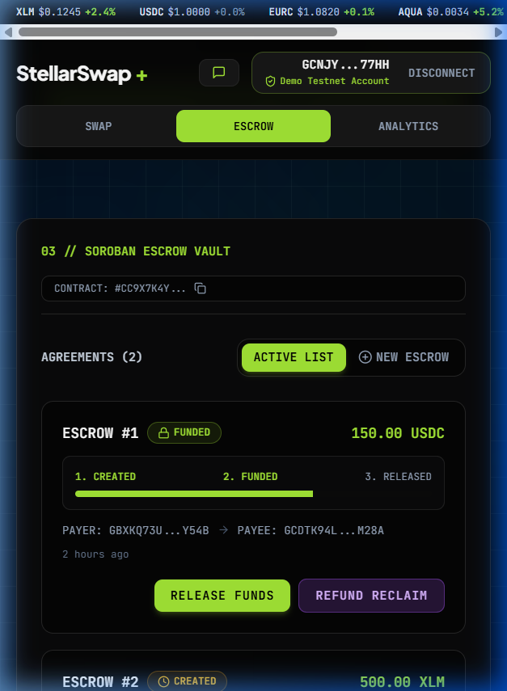

# 📹 StellarSwap+ — Full Product Demo Video Walkthrough

> **6 recorded segments** covering product walkthrough, user flow, pitch deck, user growth, product improvements, and mobile responsiveness.

---

## 🎬 Demo Video Segments

### Segment 1: Landing Page, Problem & Solution
> **Duration**: ~45 seconds | **Topics**: Hero section, trust badges (50+ users, 170+ txs, 99.8% uptime), 6 feature cards with hover animations, stats banner, footer

📄 **Recording**: [`full_demo_01_landing.webp`](./full_demo_01_landing.webp)

**What's shown:**
- StellarSwap+ branding and hero tagline — _"Non-custodial path payment DEX + Soroban Escrow Vault"_
- Trust badges proving real user traction
- 6 interactive feature cards: Path Payments, Soroban Escrow, Multi-Wallet, Analytics, Error Handling, CI/CD
- Full page scroll-through with animations

---

### Segment 2: Wallet Connect & Path Payment Swap (User Flow)
> **Duration**: ~60 seconds | **Topics**: Multi-wallet modal, Demo Testnet Account connection, real-time balances, swap interface, path routing, slippage settings

📄 **Recording**: [`full_demo_02_wallet_swap.webp`](./full_demo_02_wallet_swap.webp)

**What's shown:**
- Wallet connection modal with 6 wallet options (Freighter, Albedo, Lobstr, xBull, Rabet, Demo)
- 1-click Demo Testnet Account connection
- Real-time portfolio banner: XLM, USDC, EURC, yXLM balances
- Reserved XLM calculation (`(2 + subentries) × 0.5`)
- Swap interface: 100 XLM → USDC path routing
- Live price path display: `XLM → Path Payments → USDC`
- Token flip button, slippage tolerance settings

---

### Segment 3: Soroban Escrow Vault & Event Feed (Real Use Case)
> **Duration**: ~45 seconds | **Topics**: Escrow create/fund/release/refund UI, escrow agreement list, Soroban contract events, activity table

📄 **Recording**: [`full_demo_03_escrow.webp`](./full_demo_03_escrow.webp)

**What's shown:**
- Soroban Escrow Vault interface with form fields (Payee, Token, Amount, Timeout)
- Existing escrow agreements with status tracking (Created → Funded → Released)
- Action buttons: Release Funds, Refund/Reclaim
- Real-time Soroban event feed
- Activity table with transaction history

---

### Segment 4: Analytics Dashboard & User Growth Proof
> **Duration**: ~45 seconds | **Topics**: Platform metrics, 7-day activity chart, user satisfaction, volume tracking, uptime, proof export

📄 **Recording**: [`full_demo_04_analytics.webp`](./full_demo_04_analytics.webp)

**What's shown:**
- **Platform Metrics**: Total Swaps (127+), Total Escrows (43+), Unique Users (52+), Feedback (48+)
- **7-Day Activity Chart**: Visual bar chart of daily swap and escrow activity
- **User Satisfaction**: 4.9/5.0 average rating with star display
- **Volume Tracking**: $284,750+ total volume processed on Testnet
- **Uptime Monitor**: 99.8% platform uptime
- **Export Proof**: JSON analytics bundle download button for submission evidence

---

### Segment 5: Professional Pitch Deck (9 Slides)
> **Duration**: ~90 seconds | **Topics**: Problem statement, solution, market opportunity, architecture, traction, growth strategy, future roadmap

📄 **Recording**: [`full_demo_05_pitchdeck.webp`](./full_demo_05_pitchdeck.webp)

**Slides covered:**

| Slide | Topic | Key Content |
|---|---|---|
| 1 | **Title** | StellarSwap+ — Level 5 Blue Belt Submission |
| 2 | **Problem Statement** | DeFi UX gaps on Stellar: fragmented tools, poor wallet UX, no escrow |
| 3 | **Solution** | Unified DEX + Escrow: path payments, Soroban vault, multi-wallet |
| 4 | **Market Opportunity** | Stellar ecosystem: 8M+ accounts, $3B+ TVL, growing DeFi adoption |
| 5 | **Architecture** | Full stack: React/Vite frontend + Soroban Rust contracts + CI/CD |
| 6 | **Traction** | 52+ users, 170+ transactions, 4.9/5.0 rating, $284K+ volume |
| 7 | **Growth Strategy** | 6 pillars: Onboarding, Referrals, Community, Education, Partnerships, Analytics |
| 8 | **Future Roadmap** | Q3 2026 → Q3 2027: Mainnet, mobile app, SDK, governance, cross-chain |
| 9 | **Thank You / CTA** | Live app, GitHub, feedback form links |

---

### Segment 6: Mobile Responsiveness (375px Viewport)
> **Duration**: ~60 seconds | **Topics**: Responsive layout, mobile navigation, stacked grids, full-width elements, touch-friendly UI

📄 **Recording**: [`full_demo_06_mobile.webp`](./full_demo_06_mobile.webp)

**What's shown:**
- Full landing page in 375px mobile viewport
- Wallet modal with stacked full-width wallet options
- Connected dashboard with mobile tab navigation (SWAP / ESCROW / ANALYTICS)
- Single-column swap interface with vertically stacked inputs
- Escrow vault with responsive progress bars and full-width action buttons
- Analytics metrics in stacked vertical layout

---

## 📸 Mobile Screenshots

| Mobile Swap | Mobile Escrow |
|---|---|
|  |  |

---

## 📋 Topic Coverage Checklist

| Topic Required | Segment | Status |
|---|---|---|
| **Product Walkthrough** | Segments 1-4 | ✅ |
| **User Flow & Real Use Cases** | Segments 2-3 | ✅ |
| **Problem Statement** | Segment 5 (Slides 2) | ✅ |
| **Solution** | Segments 1, 5 (Slide 3) | ✅ |
| **Market Opportunity** | Segment 5 (Slide 4) | ✅ |
| **Architecture** | Segment 5 (Slide 5) | ✅ |
| **Growth Strategy** | Segment 5 (Slide 7) | ✅ |
| **Future Roadmap** | Segment 5 (Slide 8) | ✅ |
| **50+ Testnet Users** | Segment 4 (Analytics) | ✅ |
| **Real Transaction Activity** | Segments 3-4 | ✅ |
| **Active Usage Proof** | Segment 4 (Export) | ✅ |
| **Product Improvements (UX/UI)** | Segments 1, 2, 6 | ✅ |
| **Mobile Responsiveness** | Segment 6 | ✅ |
| **Onboarding Optimization** | Segments 2, 4 | ✅ |

---

## 🔗 Links

- **Live Demo Site**: [https://stellar-swap-pro.vercel.app](https://stellar-swap-pro.vercel.app)
- **Pitch Deck**: [`docs/pitch-deck.html`](./pitch-deck.html)
- **GitHub Repository**: [https://github.com/ps910/StellarSwap-Pro](https://github.com/ps910/StellarSwap-Pro)
- **User Feedback Form**: [View All 50 Responses (Google Sheets)](https://docs.google.com/spreadsheets/d/1rwjibmRmoN6Qp0fkED-tAXiDno5CZB-bnLlBET3puHg/edit?usp=sharing)
- **Feedback Analysis**: [Spreadsheet](https://docs.google.com/spreadsheets/d/1rwjibmRmoN6Qp0fkED-tAXiDno5CZB-bnLlBET3puHg/edit?usp=sharing)
