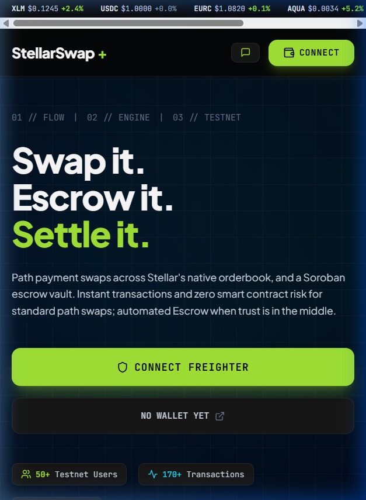
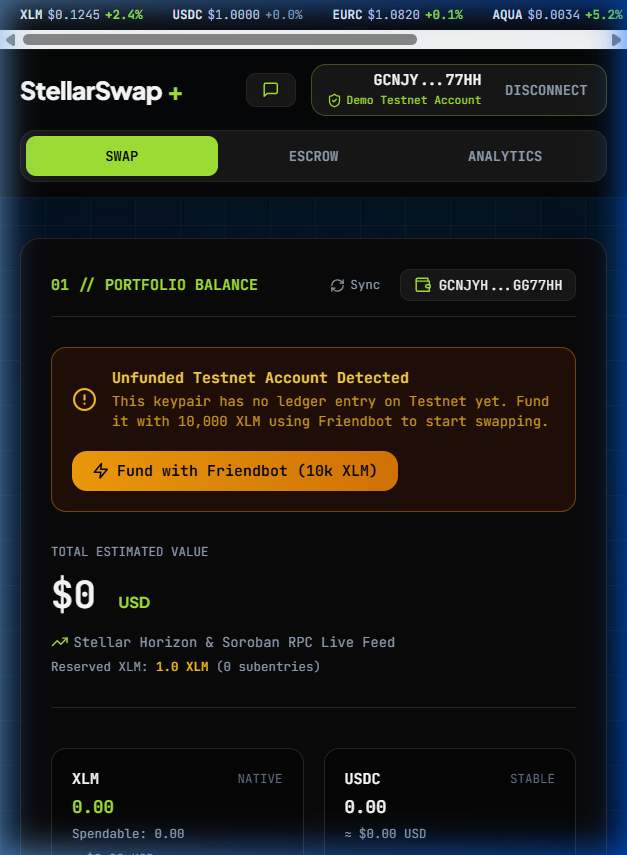
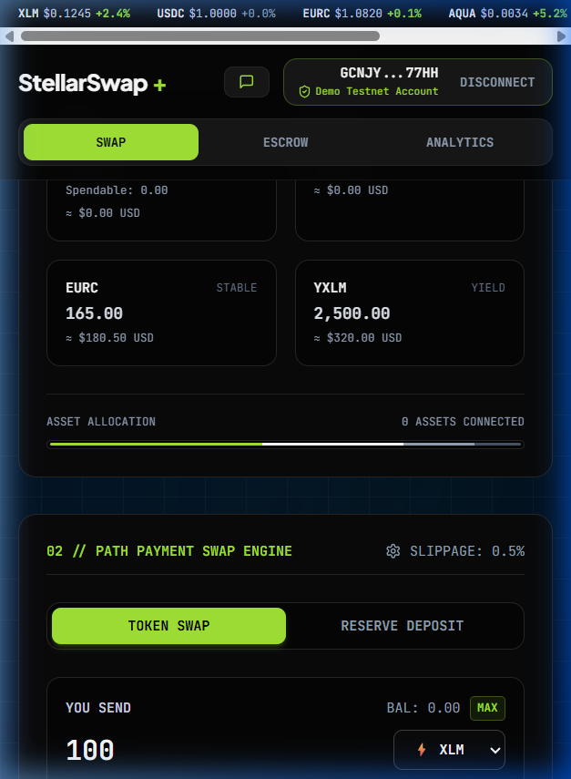

# 📹 StellarSwap+ — Demo Video Walkthrough

This document contains the recorded demo video walkthrough for the **Level 5 (Blue Belt)** submission of StellarSwap+.

---

## 🕒 Walkthrough Timeline

| Segment | Duration | Focus Area |
|---|---|---|
| **1. Landing Page & Hero** | 0:00 – 0:30 | App landing page, hero section with CTA, feature showcase, architecture overview |
| **2. Multi-Wallet Connect** | 0:30 – 0:50 | Opening wallet modal, 1-click Demo Testnet Account connection, Freighter / Albedo options |
| **3. Real-Time Balances** | 0:50 – 1:15 | Dynamic account loading, portfolio banner, XLM / USDC / EURC / yXLM balances, reserved XLM |
| **4. Path Payment DEX Swap** | 1:15 – 1:45 | Swap interface with token selection, path routing (XLM → Path Payments → USDC), slippage settings |
| **5. Soroban Escrow Vault** | 1:45 – 2:15 | Escrow creation, funding, release UI with Soroban smart contract integration |
| **6. Analytics Dashboard** | 2:15 – 2:35 | Activity table, event feed, analytics charts, Sentry error boundary |
| **7. Mobile Responsiveness** | 2:35 – 3:00 | 375px mobile viewport — responsive layout, stacked grids, full-width buttons |

---

## 🎬 Recorded Demo Videos

### Part 1 — Landing Page, Features & Wallet Connect
> Covers the full landing page walkthrough, feature showcase, scrolling through the hero section, and connecting a Demo Testnet Account via the wallet modal.

📄 **Recording**: [`stellarswap_demo_part1.webp`](./stellarswap_demo_part1.webp)

---

### Part 2 — Swap Interface, Escrow Vault & Analytics
> Demonstrates the swap form with token selection and path routing, the Soroban Escrow Vault interface, and the Analytics Dashboard with activity tracking.

📄 **Recording**: [`stellarswap_demo_part2.webp`](./stellarswap_demo_part2.webp)

---

### Part 3 — Mobile Responsiveness (375px Viewport)
> Shows the entire app in a 375px mobile viewport — landing page, wallet connect, portfolio, and swap interface all adapting to mobile layout with stacked grids and full-width elements.

📄 **Recording**: [`stellarswap_demo_mobile.webp`](./stellarswap_demo_mobile.webp)

---

## 📸 Mobile Responsiveness Screenshots

| Mobile Landing | Wallet Connected | Swap Interface |
|---|---|---|
|  |  |  |

---

## 🔗 Links

- **Live Demo Site**: [https://stellar-swap-pro.vercel.app](https://stellar-swap-pro.vercel.app)
- **GitHub Repository**: [https://github.com/ps910/StellarSwap-Pro](https://github.com/ps910/StellarSwap-Pro)
- **Pitch Deck**: [`docs/pitch-deck.html`](./pitch-deck.html) — [View Pitch Deck Guide](./pitch-deck.md)
